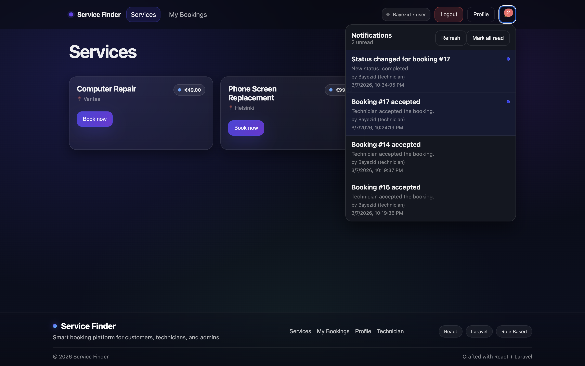

# 🔧 Service Finder

A modern **repair service booking platform** built with **React + Laravel**.  
Users can book repair services, upload problem photos, track repair progress, receive notifications, and review technicians — all from an elegant dashboard.

This project demonstrates a **full-stack architecture**, **role-based access control**, a **booking timeline system**, and a modern UI.

---

# 🚀 Features

## 👤 User
- Browse repair services
- Create booking requests
- Upload problem photos
- Track booking progress
- View technician quotes
- Receive notifications
- Leave technician ratings & reviews
- Manage personal profile

## 🧑‍🔧 Technician
- View unassigned booking requests
- Accept repair jobs
- Update repair status
- Set repair quotes
- Track assigned bookings
- View booking timeline

## 🛠 Admin
- Manage all bookings
- Assign technicians
- Update booking status
- Monitor system activity
- View analytics dashboard

---

# 🧠 Key Functionalities

## 📅 Booking Timeline
Every booking records events such as:
- Booking created
- Technician assigned
- Quote updated
- Status changed
- Repair completed

Users and technicians can view the **full history of booking events**.

---

## ⭐ Technician Rating System
After a repair is completed, users can rate the technician:

- Star rating system
- Optional written review
- Stored in database
- Used for technician performance tracking

---

## 🔔 Notification System
Users receive notifications when:

- A technician accepts a booking
- A quote is updated
- Booking status changes
- Repair is completed

Notifications appear in the navigation bar.

---

## 📊 Admin Analytics
Admin dashboard includes system insights such as:

- Total bookings
- Completed jobs
- Booking trends
- System activity

---

# 🧱 Tech Stack

## Frontend
- React
- React Router
- JavaScript
- CSS
- Fetch API

## Backend
- Laravel
- PHP
- REST API
- Eloquent ORM

## Database
- MySQL

## Tools
- Git
- GitHub
- MVC architecture
- Role-based authentication

---

# 📂 Project Structure

```
service-finder-api
│
├── Backend
│   ├── app
│   ├── database
│   ├── routes
│   └── controllers
│
├── Frontend
│   ├── src
│   │   ├── components
│   │   ├── pages
│   │   ├── api.js
│   │   └── styles.css
│
├── Screenshots
│   ├── Admin Dashboard - 1.png
│   ├── Admin Dashboard - 2.png
│   ├── Admin Analytics - 1.png
│   ├── Admin Analytics - 2.png
│   ├── Bookings page - User.png
│   ├── Services page - User.png
│   ├── Technician Dashboard - 1.png
│   ├── Technician Dashboard - 2.png
│   ├── Profile page.png
│   ├── Login page.png
│   └── Notifications.png
```

---

# 📸 Screenshots

### Login Page


### Services Page


### Creating Booking


### User Bookings


### Technician Dashboard


### Admin Dashboard


### Admin Analytics


### Notifications


### Profile Page


---

# ⚙️ Installation

## 1️⃣ Clone the repository

```bash
git clone https://github.com/yourusername/service-finder-api.git
cd service-finder-api
```

---

## 2️⃣ Backend Setup (Laravel)

```bash
cd Backend

composer install

cp .env.example .env

php artisan key:generate

php artisan migrate

php artisan storage:link

php artisan serve
```

Backend runs on:

```
http://127.0.0.1:8000
```

---

## 3️⃣ Frontend Setup (React)

```bash
cd Frontend

npm install

npm run dev
```

Frontend runs on:

```
http://localhost:5173
```

---

# 🔐 User Roles

| Role | Permissions |
|-----|-------------|
User | Create bookings, upload photos, review technicians |
Technician | Accept jobs, update status, provide quotes |
Admin | Manage bookings, assign technicians, view analytics |

---

# 🎯 Learning Goals

This project demonstrates:

- Full-stack application development
- REST API design
- Role-based authentication
- File upload handling
- Event timeline architecture
- Admin analytics dashboards
- Clean UI/UX design

---

# 📌 Future Improvements

Possible enhancements:

- Real-time notifications
- Online payments
- Technician public profiles
- Service search & filtering
- Email notifications
- Mobile optimization

---

# 👨‍💻 Author

**Bayezid Rahman Tanmay**

Full-Stack Web Development Student  
Business College Helsinki

GitHub:  
https://github.com/Bayezidtanmay

---

⭐ If you like this project, consider giving it a star!